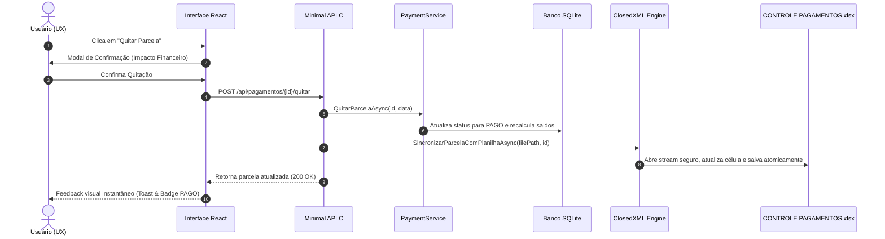

# Arquitetura do Sistema

O App-Recibos foi projetado sob os princípios de **Clean Architecture**, alta coesão e baixo acoplamento, viabilizando execução híbrida tanto no navegador quanto como aplicação desktop nativa.

## Camadas da Aplicação

### 1. Frontend (`interface/`)
- **React 19 & TypeScript**: Componentização moderna com tipagem estrita.
- **Tailwind CSS v4**: Design system refinado com suporte a temas escuro/claro e estilos específicos para impressão de documentos A4 (`print:` CSS).
- **Vite 6**: Bundler ultrarrápido com proxy reverso integrado na porta `3000` apontando para o backend na porta `5000`.
- **Modo Híbrido com Fallback**: Quando o backend C# está ativo, os dados são lidos e persistidos no SQLite; se executado de forma desconectada, utiliza `localStorage`.

### 2. Backend Core (`core/src/AppRecibos.Core/`)
- **Domínio**: Entidades imutáveis (`ContratoConfig`, `Beneficiario`, `Pagamento`) e Enums strongly-typed (`StatusParcela.Pago`, `StatusParcela.Previsto`).
- **Persistência SQLite (Dapper)**: Acesso veloz e sem overhead de ORMs pesados. Controle de integridade com chaves estrangeiras ativadas (`PRAGMA foreign_keys = ON;`).
- **Motor de Sincronização Excel (`ClosedXML`)**: `ExcelSyncEngine` processa arquivos sem travar locks do sistema operacional através de streams de memória e retentativas com jitter.
- **Motor de PDF em RAM (`QuestPDF`)**: `QuestPdfReceiptGenerator` utiliza o motor de renderização da Skia para gerar recibos A4 e pacotes ZIP sem gravar nenhum byte temporário no disco rígido.

### 3. Camada de API REST (`core/src/AppRecibos.Api/`)
- **ASP.NET Core Minimal APIs**: Endpoints diretos de alto desempenho escutando em `http://127.0.0.1:5000`.
- **CORS Desacoplado**: Permite conexões seguras de `http://localhost:3000`, `127.0.0.1` e hosts WebView.
- **Resolução de Caminhos Automática**: Localização dinâmica da planilha `CONTROLE PAGAMENTOS.xlsx` e do banco `recibos.db`.

## Diagrama de Sequência: Quitação de Parcela

