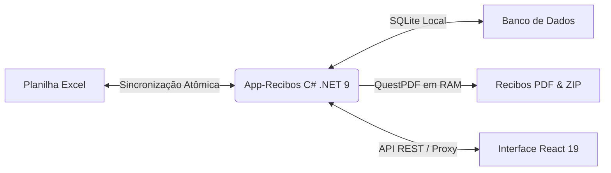

# Introdução ao App-Recibos

## Visão Geral

O **App-Recibos** é uma plataforma especializada no gerenciamento financeiro de acordos patrimoniais de **Cessão de Direitos Hereditários**, controle de amortização de parcelas e geração de recibos civis oficiais de quitação plena.

Originalmente gerido através de planilhas Excel manuais e documentos do Microsoft Word (`.docm`), o sistema foi concebido para automatizar o fluxo ponta a ponta sem perder a compatibilidade com os arquivos originais.

## Contexto Contratual

O sistema gerencia o contrato celebrado entre a parte pagadora e os três herdeiros/beneficiários:

- **Pagadora**: Abigail Paulino da Silva (CPF: `450.519.504-00`)
- **Título do Contrato**: *Contrato de Promessa de Cessão de Direitos Hereditários*
- **Data de Assinatura**: 19 de agosto de 2025
- **Beneficiários**:
  1. Elisangela Maria Vasconcelos de Araújo (Contrato: R$ 30.000,00)
  2. Flavia Maria Vasconcelos de Araújo (Contrato: R$ 30.000,00)
  3. Kleriston Vasconcelos de Araújo (Contrato: R$ 30.000,00)
- **Total Consolidado**: R$ 90.000,00 divididos em 18 parcelas por beneficiário (54 lançamentos totais).

## Principais Desafios Superados

1. **Preservação de OpenXML Complexo**: Planilhas existentes com gráficos nativos (`chart1.xml`) e tabelas com fórmulas circulares são protegidas contra quebras de serialização.
2. **Purificação Civil de Dados Bancários**: A tela permite busca estruturada de 322 bancos do BACEN com seus códigos COMPE, mas o documento civil impresso exibe estritamente a razão social pura em Title Case, sem prefixos numéricos ou apelidos parentéticos.
3. **Quitação com Segurança Financeira**: Nenhuma parcela pode ser revertida ou liquidada acidentalmente sem dupla confirmação de impacto financeiro no saldo restante.
